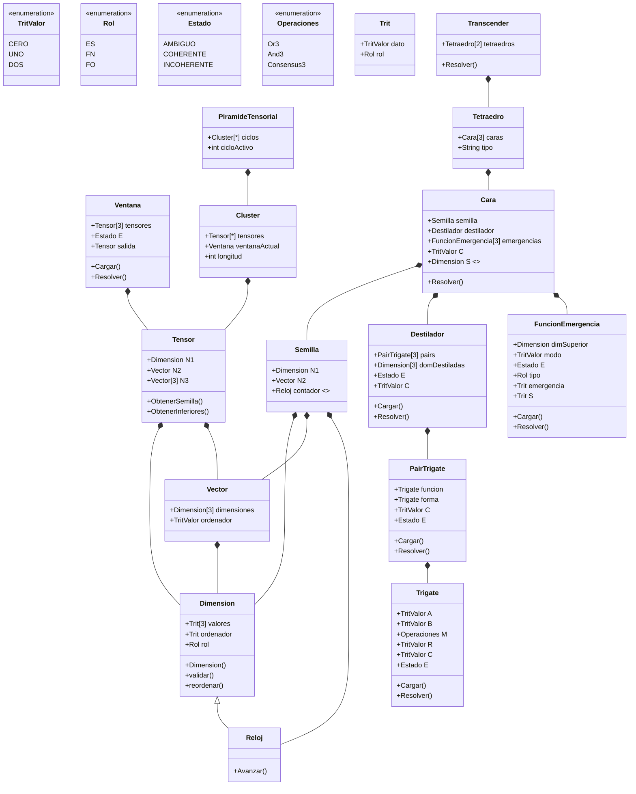

```mermaid

classDiagram

class TritValor {
  <<enumeration>>
  CERO
  UNO
  DOS
}

class Rol {
  <<enumeration>>
  ES
  FN
  FO
}

class Estado {
  <<enumeration>>
  AMBIGUO
  COHERENTE
  INCOHERENTE
}

class Operaciones {
  <<enumeration>>
  Or3
  And3
  Consensus3
}

class Trit {
  +TritValor dato
  +Rol rol
}

class Dimension {
  +Trit[3] valores
  +Trit ordenador
  +Rol rol
  +Dimension()
  +validar()
  +reordenar()
}

class Reloj {
  +Avanzar()
}

Dimension <|-- Reloj

class Vector {
  +Dimension[3] dimensiones
  +TritValor ordenador
}

class Semilla {
  +Dimension N1
  +Vector N2
  +Reloj contador <<readOnly>>
}

class Tensor {
  +Dimension N1
  +Vector N2
  +Vector[3] N3
  +ObtenerSemilla()
  +ObtenerInferiores()
}

class Ventana {
  +Tensor[3] tensores
  +Estado E
  +Tensor salida
  +Cargar()
  +Resolver()
}

class Cluster {
  +Tensor[*] tensores
  +Ventana ventanaActual
  +int longitud
}

class PiramideTensorial {
  +Cluster[*] ciclos
  +int cicloActivo
}

class Trigate {
  +TritValor A
  +TritValor B
  +Operaciones M
  +TritValor R
  +TritValor C
  +Estado E
  +Cargar()
  +Resolver()
}

class PairTrigate {
  +Trigate funcion
  +Trigate forma
  +TritValor C
  +Estado E
  +Cargar()
  +Resolver()
}

class Destilador {
  +PairTrigate[3] pairs
  +Dimension[3] domDestiladas
  +Estado E
  +TritValor C
  +Cargar()
  +Resolver()
}

class FuncionEmergencia {
  +Dimension dimSuperior
  +TritValor modo
  +Estado E
  +Rol tipo
  +Trit emergencia
  +Trit S
  +Cargar()
  +Resolver()
}

class Cara {
  +Semilla semilla
  +Destilador destilador
  +FuncionEmergencia[3] emergencias
  +TritValor C
  +Dimension S <<readOnly>>
  +Resolver()
}

class Tetraedro {
  +Cara[3] caras
  +String tipo
}

class Transcender {
  +Tetraedro[2] tetraedros
  +Resolver()
}

Vector *-- Dimension
Semilla *-- Dimension
Semilla *-- Vector
Semilla *-- Reloj
Tensor *-- Dimension
Tensor *-- Vector
Ventana *-- Tensor
Cluster *-- Tensor
PiramideTensorial *-- Cluster
Destilador *-- PairTrigate
PairTrigate *-- Trigate
Cara *-- Semilla
Cara *-- Destilador
Cara *-- FuncionEmergencia
Tetraedro *-- Cara
Transcender *-- Tetraedro

```